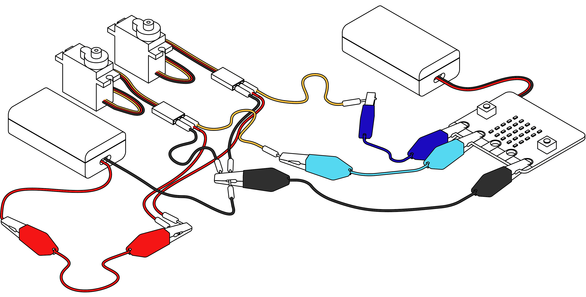
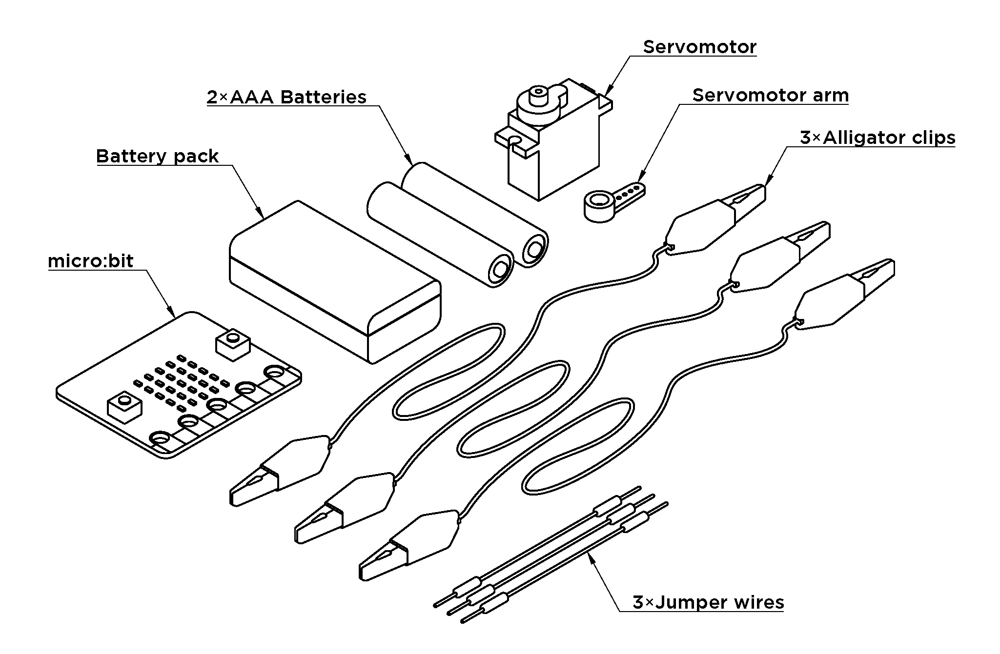

{: style="display:block;max-width:100%;"}

Good diagrams go a long way towards understanding how to set up an activity. For this project, I measured the physical materials/components using a set of digital calipers and modeled them in Autodesk Fusion 360. 

The benefit of doing this is better clarity compared to a photograph and more detailed than an abstract drawing of the materials and setup. <!--more-->You can also reuse the models to create hypothetical setups for situations where you don't have the physical components, for example a setup/layout using two servomotors and two battery packs, and to create clear layouts for a materials list.

{: style="display:block;max-width:100%;"}

{: style="display:block;max-width:100%;"}